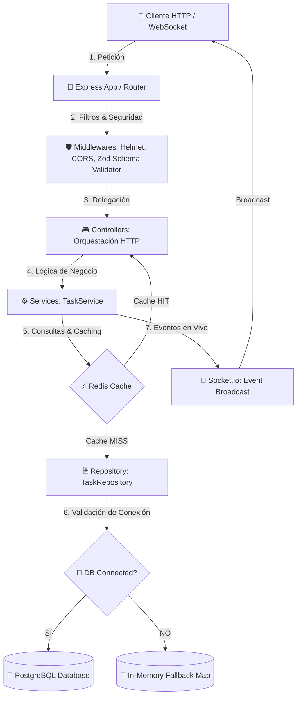

# 🎯 Clean Architecture Showcase API

[](https://nodejs.org/)
[](https://www.typescriptlang.org/)
[](https://expressjs.com/)
[](https://opensource.org/licenses/MIT)

Este proyecto es un **Showcase para Portafolio Técnico** que demuestra la implementación de patrones de **Clean Architecture** (Arquitectura Limpia), resiliencia, alta disponibilidad ante fallos de infraestructura, y programación asíncrona segura con **Node.js, Express, TypeScript, PostgreSQL y Redis**.

El objetivo de este repositorio es ilustrar cómo estructurar un backend corporativo escalable y preparado para producción, integrando mecanismos de degradación graciosa (fallback en memoria cuando la base de datos o el caché no están disponibles).

---

## 🏗️ Diagrama de Arquitectura y Flujo



---

## 🛠️ Stack Tecnológico & Arquitectura

* **Core**: Node.js v18+ con TypeScript estricto.
* **API Framework**: Express.js configurado con routing modular.
* **Seguridad**: Helmet para cabeceras de seguridad HTTP, CORS restrictivo configurable, Zod para validación criptográfica de esquemas (Request Validation).
* **Bases de Datos & Caché**:
  * **PostgreSQL** mediante Pool de conexiones optimizado.
  * **Redis** (o Upstash) para almacenamiento de caché distribuida.
* **Tiempo Real**: **Socket.io** modularizado para notificaciones bidireccionales automáticas.
* **Gestión de Errores**: Jerarquía personalizada de errores (`CustomError`) que previene la filtración de detalles del servidor al cliente.

---

## 🔒 Patrones de Resiliencia Implementados

### 1. Degradación Graciosa a Base de Datos (In-Memory Fallback)
Si PostgreSQL experimenta una caída, el repositorio lo detecta automáticamente de forma no bloqueante y cambia a un modo de **almacenamiento en memoria** (usando `Map` de JS). El cliente nunca recibe un error 500; la API sigue respondiendo consultas y guardando información temporalmente. Al restaurarse el servicio, vuelve a conectarse sin necesidad de reiniciar el backend.

### 2. Caching Transparente a Fallos
El helper de Redis captura excepciones de conexión de red internamente. Si Redis se desconecta, las llamadas de lectura y escritura de caché devuelven `null` en milisegundos (Cache Miss virtual), desviando el tráfico directamente al repositorio de forma fail-safe.

---

## ⚙️ Estructura del Código

La estructura sigue un diseño modular por dominio (Features) e introduce abstracciones claras entre responsabilidades:

```txt
src/
├── app.ts                  # Configuración de Express y middlewares
├── server.ts               # Punto de entrada y listener de red
├── config/                 # Infraestructura (Base de datos, Redis, Sockets, Env)
├── core/
│   ├── errors/             # Clases de error personalizadas y serializables
│   └── utils/              # Funciones auxiliares
├── middlewares/            # Filtros globales (CORS, validación, error handler)
└── modules/                # Módulo de lógica de negocio modular por dominio
    └── task/
        ├── task.controller.ts  # Orquestador HTTP (req/res)
        ├── task.repository.ts  # Capa de datos con estrategia de failover
        ├── task.routes.ts      # Endpoints y middleware de validación asignados
        ├── task.service.ts     # Lógica y orquestación de caché y sockets
        └── task.types.ts       # Definición de tipos y esquemas de Zod
```

---

## 🚀 Guía de Instalación y Ejecución

### 1. Requisitos Previos
* Node.js >= 18.x.x
* npm >= 9.x.x

### 2. Configuración
Copia el archivo `.env.example` y renómbralo a `.env`:
```bash
cp .env.example .env
```
Ajusta las variables de entorno de PostgreSQL y Redis en el archivo `.env` según tu entorno local.

### 3. Instalación de Dependencias
```bash
npm install
```

### 4. Modo de Desarrollo (Hot Reload)
```bash
npm run dev
```

### 5. Compilación y Construcción para Producción
```bash
npm run build
npm start
```

---

## 🧪 Endpoints de Demostración (API Tasks)

| Método | Endpoint | Descripción | Payload de Entrada (JSON) |
|---|---|---|---|
| **POST** | `/api/tasks` | Crea una nueva tarea (Emite WebSocket `task_created`) | `{"title": "Implementar CI/CD", "description": "Opcional"}` |
| **GET** | `/api/tasks` | Devuelve todas las tareas (Usa caché en Redis si está activo) | Ninguno |
| **GET** | `/api/tasks/:id` | Devuelve una tarea por ID | Ninguno |
| **PATCH** | `/api/tasks/:id` | Actualiza campos (Emite WebSocket `task_updated`) | `{"status": "in_progress"}` |
| **DELETE** | `/api/tasks/:id` | Elimina una tarea (Emite WebSocket `task_deleted`) | Ninguno |
| **GET** | `/api/health` | Diagnóstico de salud de la API | Ninguno |

---

## 📄 Licencia

Este proyecto está bajo la licencia MIT. Siéntete libre de adaptarlo para tus propios desarrollos.
